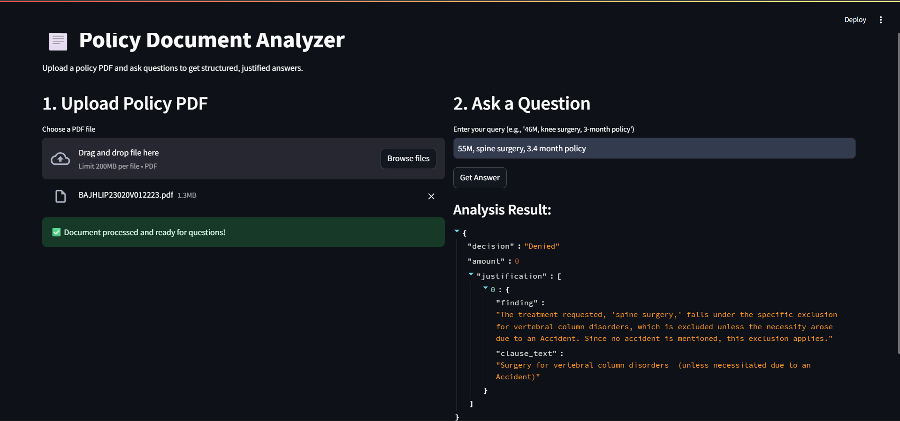

# 📄 AI-Powered Policy Document Analyzer

A robust Retrieval-Augmented Generation (RAG) system designed to automate the analysis of insurance policy documents.  
This application uses Large Language Models (LLMs) to interpret complex policy PDFs and provide structured, auditable decisions for claims processing.

---

## 🚀 Overview

Processing insurance claims manually is slow and error-prone.  
This system enables users to upload a policy document (PDF) and ask natural-language queries about coverage.

**Example:**  
> *“26M, 3-month policy, knee surgery, ₹89,000 — will this claim be approved?”*

The system:

- Retrieves relevant clauses from the PDF  
- Evaluates the claim **strictly based on those clauses**  
- Returns a structured **JSON decision** containing:  
  - Approval/Rejection  
  - Eligible amount  
  - Justification quoting the policy text  

---

## ✨ Key Features

- 📄 **PDF Ingestion** – Handles complex, unstructured policy PDFs  
- 🧠 **Semantic Search** – Embedding-based clause retrieval  
- 🤖 **AI Reasoning** – LLM-powered logic for age limits, exclusions, durations, etc.  
- ✅ **Structured Output** – Clean JSON response ready for claims systems  
- 🔍 **Auditable Justification** – Every decision cites exact policy text  

---

## 🛠️ Tech Stack

- **Language:** Python 3.10+  
- **Backend:** FastAPI  
- **Frontend:** Streamlit  
- **AI Orchestration:** LangChain  
- **Vector DB:** ChromaDB  
- **LLM & Embeddings:** Google Gemini Pro + Google Generative AI Embeddings  
- **PDF Processing:** PyPDF  

---

## 📂 Project Structure

```

doc_processor/
├── backend/
│   ├── main.py            # FastAPI backend
│   └── ...
├── frontend/
│   ├── app.py             # Streamlit frontend
│   └── ...
├── chroma_db/             # Local vector DB (auto-generated)
├── temp_uploads/          # Temporary uploaded files (auto-generated)
├── .env                   # API keys
├── requirements.txt       # Dependencies
└── README.md              # Documentation

````

---

## ⚙️ Installation & Setup

### **Prerequisites**
- Python 3.10+
- Google AI Studio API Key

---

### **1. Clone the Repository**

```bash
git clone <your-repo-url>
cd doc_processor
````

---

### **2. Install Dependencies**

> Recommended: use a virtual environment.

```bash
python -m venv venv
```

**Windows:**

```bash
venv\Scripts\activate
```

**Mac/Linux:**

```bash
source venv/bin/activate
```

**Install requirements:**

```bash
pip install -r requirements.txt
```

---

### **3. Configure Environment Variables**

Create `.env` in project root:

```
GOOGLE_API_KEY="your_google_api_key_here"
```

---

## 🏃‍♂️ Running the Application

Run **backend** and **frontend** in separate terminals.

### **Terminal 1 – Start Backend API**

```bash
uvicorn backend.main:app --reload
```

Wait until:

```
Application startup complete.
```

### **Terminal 2 – Start Frontend**

```bash
streamlit run frontend/app.py
```

Frontend will open at:
👉 [http://localhost:8501](http://localhost:8501)

---

## 📝 Usage Guide

1. **Upload Policy**

   * Click **Browse files** in the left panel
   * Upload your policy PDF

2. **Wait for Processing**

   * System chunks + indexes the PDF
   * You will see:
     ✔️ *Document processed*

3. **Ask a Query**
   Example:

   ```
   46M, knee surgery, Pune, 3-month policy
   ```

4. **View Results**

   * Outputs a structured JSON
   * Includes decision + referenced clauses

---

## 📸 Demo Screenshot



## 🧩 Troubleshooting

### **`[WinError 32] The process cannot access the file`**

* Windows file-locking issue
* Make sure **VS Code / Explorer** isn't holding the `chroma_db` folder open
* Retries are built in, but closing external tools helps

### **`Connection Refused`**

* Backend must start **before** using the frontend

---

## 📜 License

This project is open-source and available under the **MIT License**.

---
